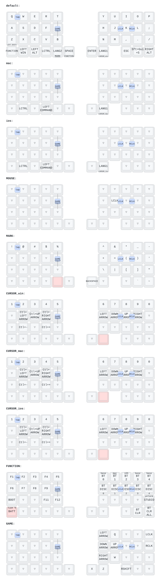

# キーマップ

`config/LiNEA40.keymap` を [keymap-drawer](https://github.com/caksoylar/keymap-drawer) で図にしたものです。
キーマップを変更したら `make keymap-svg` で再生成してください。



## レイヤー

| # | 名前 | 入り方 |
|---|---|---|
| 0 | `default` | — |
| 1 | `mac` | `BT 1`（FUNCTION レイヤー）で有効化。BT プロファイル1と連動 |
| 2 | `ios` | `BT 2`（FUNCTION レイヤー）で有効化。BT プロファイル2と連動 |
| 3 | `MOUSE` | トラックボールを動かすと自動で有効（600ms 後に解除） |
| 4 | `MARK` | 左親指 `LANG2` を長押し |
| 5 | `CURSOR_win` | 右親指 `LANG1` を長押し |
| 6 | `CURSOR_mac` | `mac` レイヤー中に右親指 `LANG1` を長押し |
| 7 | `CURSOR_ios` | `ios` レイヤー中に右親指 `LANG1` を長押し |
| 8 | `FUNCTION` | 左親指 `SPACE` を長押し。この間トラックボールはスクロールになる |

`extra_0`–`extra_2`（9–11）は ZMK Studio が実行時にレイヤーを追加するための空きスロットで、
`status = "disabled"` のため図には含めていません。

## 図の読み方

- キー中央が単押し、左上が長押し（モディファイア）、左下が長押しで開くレイヤー名
- `▽` は `&trans`（下のレイヤーをそのまま通す）
- 薄い赤のキーは、そのレイヤーを開いているキー自身
- 青い小さなキーはコンボ。2キー同時押しで発動し、どのレイヤーでも有効

## 再生成

```sh
make keymap-svg
```

初回は `.venv-keymap/` に仮想環境を作って keymap-drawer を入れます（`.gitignore` 済み）。
2回目以降は生成だけ走ります。

表示名の調整は `keymap_drawer.config.yaml` で行います。
このキーマップは C で書いた独自ビヘイビア（`bt_layer` / `bt_base` / `batt_disp`）を使っており、
keymap-drawer はそれらの意味を知らないため、`raw_binding_map` で表示名を与えています。
ビヘイビアを追加したら、ここにも1行足してください。

## 依存バージョンの固定について

`Makefile` は `tree-sitter` を **0.24.0**、`tree-sitter-devicetree` を **0.14.1** に固定しています。
keymap-drawer 0.21.0 は `tree-sitter>=0.24,<1.0` を許容していますが、実際には次の理由で
この組み合わせ以外は動きません。

| tree-sitter | 症状 |
|---|---|
| 0.26.x | `Language.query` が削除済み → `AttributeError` |
| 0.25.x | `Query.captures` が削除済み → `AttributeError` |
| 0.24.0 + devicetree 0.15.0 | 文法の ABI が 15 で新しすぎる → `Incompatible Language version 15` |
| **0.24.0 + devicetree 0.14.1** | **動作する** |

keymap-drawer が新しい tree-sitter に追従したら、この固定は外せます。

## ブラウザで試す

インストールせずに確認するだけなら https://caksoylar.github.io/keymap-drawer/ に
`config/LiNEA40.keymap` の中身を貼り付けても描画できます。
ただし独自ビヘイビアの表示名は当たりません。
